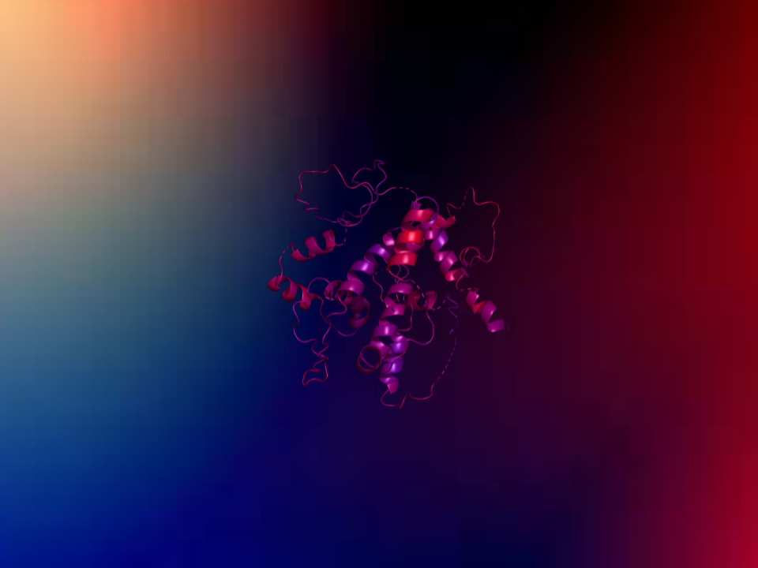
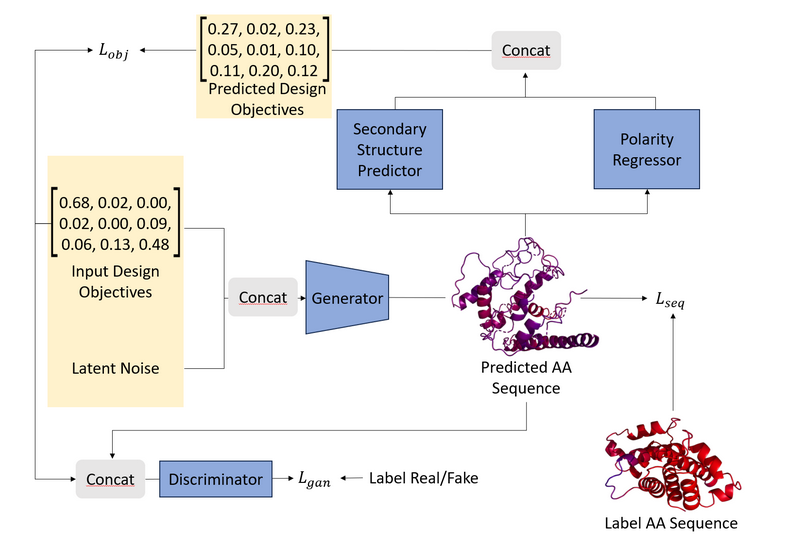

<!-- PROJECT SHIELDS -->
[![Contributors][contributors-shield]][contributors-url]
[![Forks][forks-shield]][forks-url]
[![Issues][issues-shield]][issues-url]
[![MIT License][license-shield]][license-url]
[![LinkedIn][linkedin-shield]][linkedin-url]


<!-- PROJECT LOGO -->
<br />
<div align="center">
  <a href="https://github.com/github_username/repo_name">
    
  </a>

<h3 align="center">Adversarially-Driven Generation of De Novo Proteins for Therapeutic Drug Design</h3>

  <p align="center">
    Proteins are critical components of life that have shown promising results as synthetic medications. However, the process of developing therapeutic proteins requires immense amounts of time for testing and validation. Machine Learning (ML) has shown to be a powerful tool that can understand complex protein sequences, and recent research has taken advantage of its capabilities for protein design. However, limited methods exist to do so, and to the best of our knowledge, existing models do not ensure that output proteins are both feasible enough to prevent unnecessary testing of proteins and diverse enough to enable a large variety of output protein combinations. As such, we propose Cycle-Consistent Conditional Protein Generative Adversarial Network, or CCC-ProGAN, which utilizes secondary structure and primary structure design objectives in order to produce peptide-based therapeutics for specific applications. We mathematically define key losses for optimization in protein generation. After conditioning, we evaluate CCC-ProGAN on a test dataset of 65 samples and 15 randomly-generated proteins, showing that CCC-ProGAN is a good candidate for protein generation.
    <br />
    <a href="https://github.com/github_username/repo_name"><strong>Explore the docs »</strong></a>
    <br />
  </p>
</div>


<!-- TABLE OF CONTENTS -->
<details>
  <summary>Table of Contents</summary>
  <ol>
    <li>
      <a href="#about-the-project">About The Project</a>
      <ul>
        <li><a href="#built-with">Built With</a></li>
      </ul>
    </li>
    <li>
      <a href="#getting-started">Getting Started</a>
      <ul>
        <li><a href="#prerequisites">Prerequisites</a></li>
        <li><a href="#installation">Installation</a></li>
      </ul>
    </li>
    <li><a href="#usage">Usage</a></li>
    <li><a href="#roadmap">Roadmap</a></li>
    <li><a href="#contributing">Contributing</a></li>
    <li><a href="#license">License</a></li>
    <li><a href="#contact">Contact</a></li>
    <li><a href="#acknowledgments">Acknowledgments</a></li>
  </ol>
</details>


<!-- ABOUT THE PROJECT -->
## About The Project



Algorithmic code implementation of "Adversarially-Driven Generation of De Novo Proteins for Therapeutic Drug Design."

<p align="right">(<a href="#readme-top">back to top</a>)</p>


<!-- GETTING STARTED -->
## Getting Started

### Installs and setup

- please run the following commands in shell from the root directory

```
chmod +x ./gan_protein_structural_requirements/scripts/setup_script.sh

./gan_protein_structural_requirements/scripts/setup_script.sh
```

### Prerequisites

run the following commands separately for basic installation of prereqs

- conda is required, see [this link](https://www.anaconda.com) for more information of installation for your system

Please run the following commands:
- `conda install -c salilab dssp`

once installed, please run 
```
conda env create -f environment.yml

conda activate protein_proj
```


<!-- LICENSE -->
## License

Distributed under the MIT License. See `LICENSE.txt` for more information.

<p align="right">(<a href="#readme-top">back to top</a>)</p>


<!-- MARKDOWN LINKS & IMAGES -->
<!-- https://www.markdownguide.org/basic-syntax/#reference-style-links -->
[contributors-shield]: https://img.shields.io/github/contributors/github_username/repo_name.svg?style=for-the-badge
[contributors-url]: https://github.com/github_username/repo_name/graphs/contributors
[forks-shield]: https://img.shields.io/github/forks/github_username/repo_name.svg?style=for-the-badge
[forks-url]: https://github.com/Rohit-K814307/gan_protein_structural_requirements/forks
[issues-shield]: https://img.shields.io/github/issues/github_username/repo_name.svg?style=for-the-badge
[issues-url]: https://github.com/Rohit-K814307/gan_protein_structural_requirements/issues
[license-shield]: https://img.shields.io/github/license/github_username/repo_name.svg?style=for-the-badge
[license-url]: https://www.linkedin.com/in/rohit-kulkarni-305a86202/
[linkedin-shield]: https://img.shields.io/badge/-LinkedIn-black.svg?style=for-the-badge&logo=linkedin&colorB=555
[linkedin-url]: https://linkedin.com/in/linkedin_username
[product-screenshot]: images/screenshot.png
[Next.js]: https://img.shields.io/badge/next.js-000000?style=for-the-badge&logo=nextdotjs&logoColor=white
[Next-url]: https://nextjs.org/
[React.js]: https://img.shields.io/badge/React-20232A?style=for-the-badge&logo=react&logoColor=61DAFB
[React-url]: https://reactjs.org/
[Vue.js]: https://img.shields.io/badge/Vue.js-35495E?style=for-the-badge&logo=vuedotjs&logoColor=4FC08D
[Vue-url]: https://vuejs.org/
[Angular.io]: https://img.shields.io/badge/Angular-DD0031?style=for-the-badge&logo=angular&logoColor=white
[Angular-url]: https://angular.io/
[Svelte.dev]: https://img.shields.io/badge/Svelte-4A4A55?style=for-the-badge&logo=svelte&logoColor=FF3E00
[Svelte-url]: https://svelte.dev/
[Laravel.com]: https://img.shields.io/badge/Laravel-FF2D20?style=for-the-badge&logo=laravel&logoColor=white
[Laravel-url]: https://laravel.com
[Bootstrap.com]: https://img.shields.io/badge/Bootstrap-563D7C?style=for-the-badge&logo=bootstrap&logoColor=white
[Bootstrap-url]: https://getbootstrap.com
[JQuery.com]: https://img.shields.io/badge/jQuery-0769AD?style=for-the-badge&logo=jquery&logoColor=white
[JQuery-url]: https://jquery.com 
